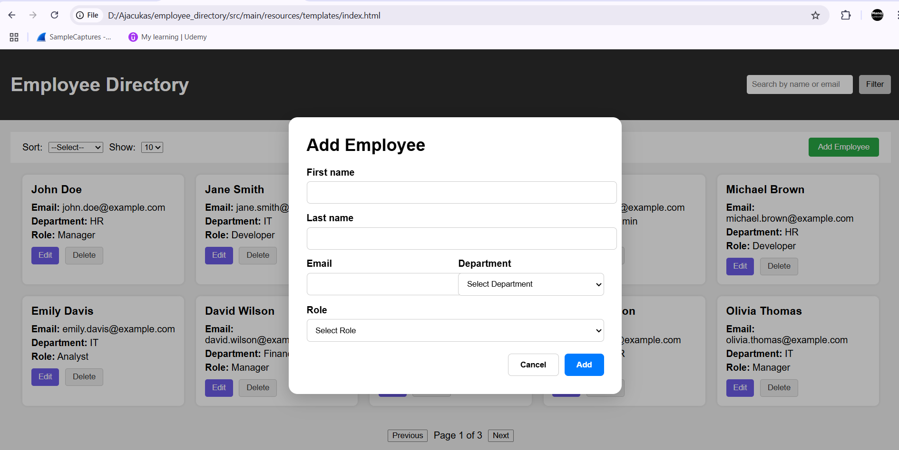

---

## ⚙️ How to Run the Project

1. Clone this repository or [download ZIP](https://github.com/ManojKumarSreeram/employee_directory.git)

2. Open the folder in your code editor.

3. Run the app:
   - Simply open `index.html` in your browser.
   - **No backend or npm required**.

---

## 🖼️ Screenshots

Please include these screenshots in a `screenshots/` folder and link them here in the README.

| Feature | Screenshot |
|--------|------------|
| 💻 Full Dashboard (Desktop View) |  |
| 📱 Mobile Responsive View |  |
| ➕ Add/Edit Employee Modal |  |
| 🔠Search and Filter Panel |  |
| 📄 Pagination Controls |  |
---

## 💭 Reflection

### ✅ What Went Well
- Successfully built a clean, responsive, fully functional UI with vanilla JavaScript.
- Implemented key business logic like pagination, filtering, sorting, and CRUD operations without backend dependency.
- Maintained good code organization and modularity.

### 🚧 Challenges Faced
- Ensuring mobile responsiveness for toolbars and forms.
- Simulating a clean form modal and side-filter layout with plain JS and CSS.
- Managing search + filter + sort + pagination interactions simultaneously.

### 🔧 Improvements for the Future
- Add persistent storage using `localStorage` or mock APIs (like JSON Server).
- Implement unit testing using Jest or similar.
- Refactor to modular JS files using ES Modules or a framework like React.
- Add animations, transitions, and keyboard accessibility for better UX.

---

## 👨‍💻 Developed By

- **Manoj Kumar**
- Frontend Developer | HTML | CSS | JavaScript

---

## 📄 License

This project is for technical assessment purposes and not intended for production use.
